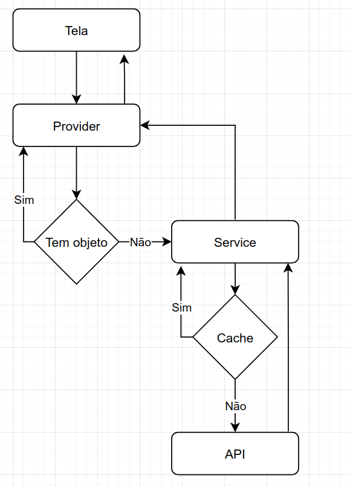

# Trigg Flutter APP

Aplicativo em flutter do cartão de crédito Trigg

## Executando
Esse projeto está desenvolvido em [flutter](https://flutter.dev/docs), então tenha certeza que que você possui o flutter instalado e algum simulador ou conexão com seu dispositivo móvel para executar o aplicativo. Também é importante ter na raiz do projeto um `.env` válido vc pode criar um a partir do `.env.tst` ou do `.env.prod`

## Estrutura
### Fluxo da aplicação
O fluxo de conexão/estrutura de dados da aplicação funciona da seguinte forma:

A tela sempre irá solicitar as informações necessárias para ela para um [provider](https://pub.dev/packages/provider) (cartão, cliente, etc...). Então o Provider verifica se já possui um objeto com essa informação, se sim, retorna-o, caso contrário solicita o objeto para o service, o service verifica se possuí o objeto em cache para fornecer como resposta, caso não tenha, faz um request para a API.



Importante também é que todos os objetos transitados são tipados, sendo assim, o provider nunca deve retornar algo com o tipo `dynamic` ou `List<dynamic>` por exemplo.
Para que a tela sempre tenha todos os elementos necessários para construção.

### Sobre BLoC
O padrão de providers deve seguir a padrão BLoC, não fazendo nenhum tipo de lógica ou regra de negócios nas camadas de visualizações (screens), todas as regras de negócios devem ter seus respectivos providers e todas as conexões externas devem ter seus services.

### Chamadas para as API
as chamadas REST são feitas pelos services, todo provider tem seu próprio service para chamadas REST da api, mas todos eles estendem um [main_service.dart](lib/services/main_service.dart) facilitando o tratamento de erros, validação de challenges, etc...
Então caso um novo provider seja criado e ele precise fazer chamadas REST que ainda não foram implementadas, é necessário que um novo service seja criado.

### Provendo os objetos para a tela
Os objetos transitados pelos widgets, como cartão e cliente por exemplo, devem sempre ser retornados via provider, assim a tela sempre pode chamar o provider do seu contexto e ser redesenhado caso necessário (watch) ou apenas consumir a informação para criação do seu widget (read).
É importante lembrar que o provider deve ser criado um widget antes dele ser consumido, até agora todos os providers estão sendo fornecidos no [main.dart](lib/main.dart) uma vez que descê-los apenas um nível na árvore de widget não nos traria grandes ganhos de performance e apenas dividiria a construção de providers. Penso que a melhor maneira é continuar servindo todos os providers no `main.dart`, e caso algum provider seja muito especifico para um fluxo, ele seja criado no scafold daquele fluxo, como é o caso da aquisição que tem seu próprio provider para controle de fluxo. Lembrando sempre que um provider deve retornar um model.

Já o objeto/função que desejamos reutilizar seja de baixo nível (não é uma tela e portanto não tem contexto) ao invés de ficarmos sempre passando o objeto de contexto pela árvore, optei por criar um singleton na pasta `utils/` assim ele não sera reescrito e sempre existira na sessão ativa do app, os utils funcionam semelhantemente aos providers, porem, não dependem de contexto e não devem ser utilizados para retornar objetos as telas.

### Variáveis de ambiente
Nosso APP será o mesmo para Android e IOS então não existem validações ou flavors baseados no ambiente do sistema operacional, porem, na raiz do projeto existem dois arquivos de ambiente `.env.prod` e `.env.tst` que possuem informações como URL da API e sua autenticação. Podemos utilizar isso para alterar o ambiente em que nossa aplicação está trabalhando, copiando um deles (ou criando um) para a raiz do projeto como `.env`, esse arquivo não deve ser monitorado pelo git para que cada ambiente possa escrever suas próprias necessidades e o `main.dart` sempre irá consultar o `.env`

## Tema e componentização
Tudo que for padrão como fonte padrão, primal color, error color, accent color, text color no field, espaçamento de botão, etc. Está definido no [trigg_theme.dart](lib/widgets/trigg_theme.dart), caso o estilo que você está tentando utilizar não seja implementando por padrão pelo tema, sempre utilize o `Theme.of(context)` para isso e se possível crie um widget para cada novo componente que precisar de uma implementação de estilo diferente.
Siga sempre o conceito de componentização, e "monte" os widgets com o mínimo de customização possível, se alguma customização é necessária, crie um widget e utilize-o na "montagem" dos seu widget principal

Sempre foque na reutilização de código, os widgets são excelentes para isso, nunca crie algo pensando que somente aquele widget especifico vai ter uma determinada configuração, sempre crie algo pensando que outros 10 widgets vão precisar implementar essa customização, então sempre faça de um jeito que seja possível reutilizar o seu componente em outros lugares.

## Mock
Utilizando o arquivo `.env` você pode colocar a opção `MOCK=true` no arquivo para que o service passe a ser mockado. Com o service mockado, o APP não ira fazer requisições HTTP mas sim retornar respostas predefinidas.

### Definindo respostas do mock
Para definir uma resposta mockada, vá até o arquivo [mock_client.dart](lib/services/mock_client.dart), o arquivo está definido com um switch case de paths das URLs da API, defina a URL que você quer mockar e disponibilize um retorno. O retorno deve preferivelmente ser um json salvo na pasta **/assets/mock/** e então no mock client pode retornar `rootBundle.loadString('assets/mock/SEU_JSON.json')`.

### Criando json de retorno
O Json mockado do retorno deve ser igual ao retorno da API para aquele path específico, para saber o retorno da API em um determinado método, você pode consultar o postman da API que possuí exemplos de retorno, ou fazer um request e salvar o retorno em um arquivo. Caso você queira salvar o retorno do HTTP Response baseado em um print no console, o Flutter pode exibir a resposta "truncada" no console, se esse for o caso utilize `printWrapped` na nossa pasta de **utils/**

## Testes
Seguimos o padrão de testes apresentado no [site oficial do flutter](https://flutter.dev/docs/testing) onde os testes unitários e os teste de widgets ficam na pasta **test/** que segue a exata mesma estrutura da pasta **lib/** e os teste de integração ficam na pasta **integration_test/**

### Testes unitários
Um teste unitário deve testar no máximo um arquivo, tendo dependência ou não de outros. Podemos testar várias funcionalidades do mesmo arquivo utilizando um grupo de testes, mas sempre uma validação por teste

### Teste de wigets
Esses testes consistem em confirmar que a tela é exibida do jeito que deveria, utilize esses testes para confirmar que determinados widgets são exibidos de maneira correta, no momento certo e na ordem esperada

### Teste de integração
Esses testes são para testar fluxos completos como todo o processo de aquisição, ou um "caminho" que o usuário faz normalmente, como pagar a fatura ou resgatar o cashback

## Challenges
Os challenges, como two step por exemplo, precisam de uma screen para serem resolvidos. Pensando nisso, para que não seja necessário o controle e manipulação de contexto a nível de serviço, foi criado um [navigator](lib/utils/trigg_navigator.dart) para que o service possa utilizá-lo sem contexto, para conseguir exibir as telas de challenge. Mesmo assim, os challenges devem retornar suas exceptions. É importante que a tela do challenge consiga se resolver sozinha, sem a necessidade de um catch, e também é importante que a "rechamada" do método que gerou o challenge também seja feito de forma automática, veja o [main_service.dart](lib/services/main_service.dart) para um melhor entendimento.

### Twostep
O twostep é uma autenticação em duas etápas, ela já está sendo validada no [main_service.dart](lib/services/main_service.dart) e se irá exibir a tela para sua resolução e em seguida refazer o request que gerou o challenge de twostep, veja [twostep_screen.dart](lib/screens/twostep_screen.dart) para um melhor entendimento.

## Firebase
A conexão com o firebase no android é feita pela própria pasta android e não na pasta lib, a pasta lib simplesmente faz a inicialização do firebase app.
Na pasta **android/app** está o arquivo `google-services.json` que fazer a conexão com o firebase, caso seja necessário trocar o ambiente do firebase, esse arquivo deve ser alterado.

### Crashlytics
A conexão com o crashlytics é feita no [main.dart](lib/main.dart) definindo que todo `FlutterError` seja enviado como um erro do crashlytics, a aplicação também está sendo executada dentro de uma `ZonedGuarded` para capturar qualquer erro que seja zoneado pelo flutter. Assim qualquer exception será enviada diretamente para o crashlytics

### Analytics
O Firebase Analytics possui um singleton [analytics.dart](lib/utils/analytics.dart) na pasta `utils/` para utiliza-lo basta usar essa instância.

### Remote config
O remote config está sendo inicializado junto com todas as dependências firebase no **main.dart**.
Para utilizar o remote config basta importar a instância do *RemoteConfig* e fazer o get da propriedade necessária:
```dart
final RemoteConfig remoteConfig = RemoteConfig.instance;
print(remoteConfig.getString('cartao_detalhe_id_ordem'));
```

## Appsflyer
O appsflyer assim como os outros plugins está sendo inicializado no **main.dart**, ele possui um singleton [appsflyer.dart](lib/utils/appsflyer.dart) na pasta `utils/`, para fazer o log de algum evento basta chamar `Appsflyer.logEvent(name, values)` onde name é o nome do evento que será apresentado no dashboard e value é um mapa com os valores